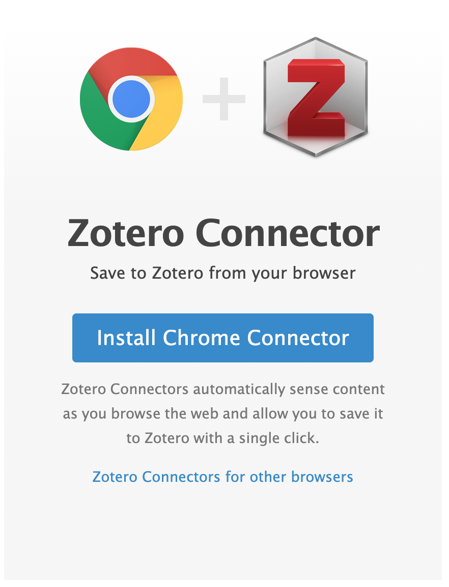
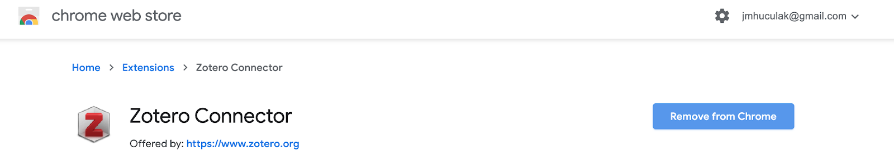
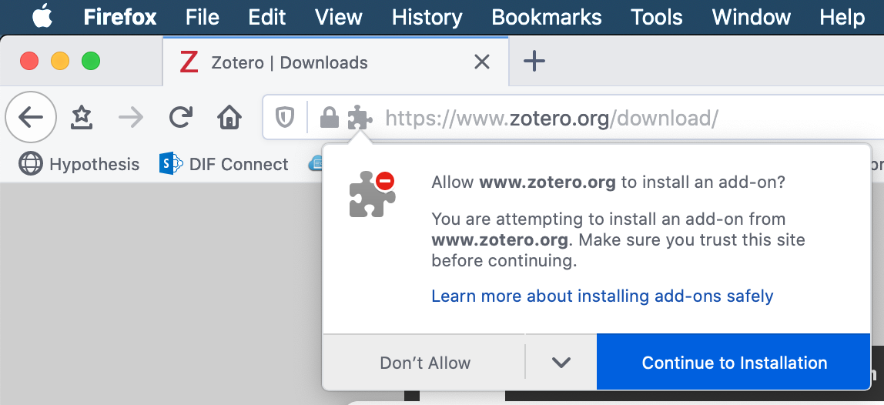
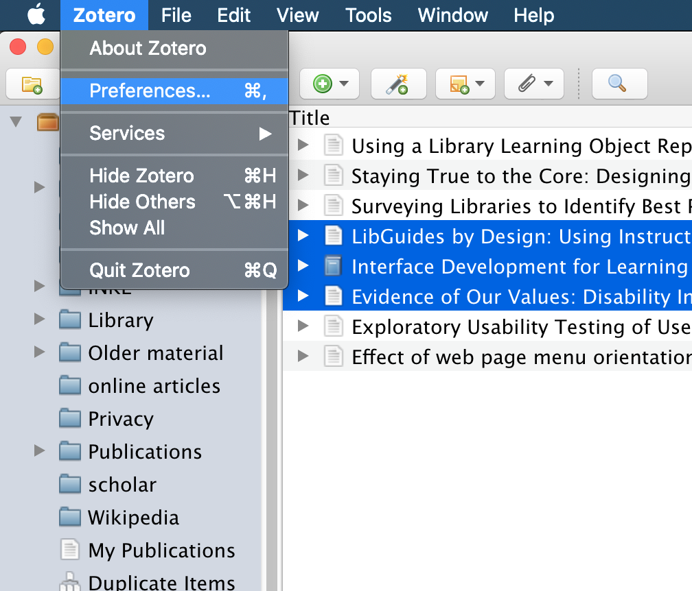
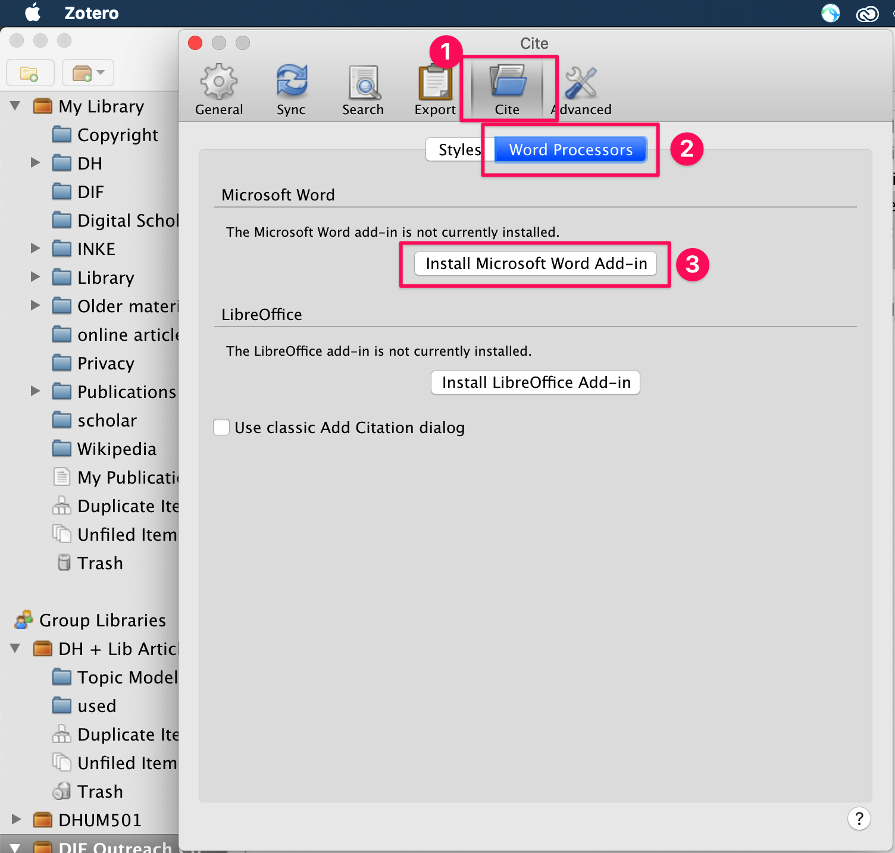
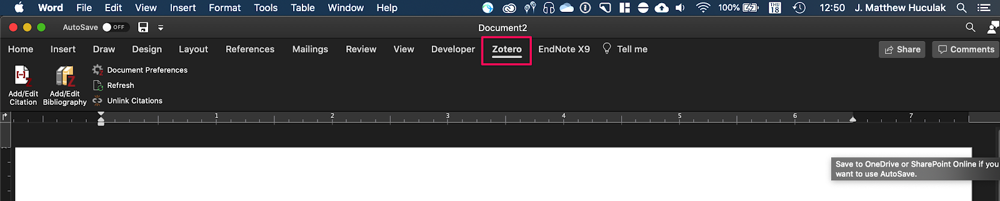

# Adding Browser and Word Connectors

In this exercise you will:
- Add the browser connector so you can automatically download source information from websites
- Install the Word plugin so you can add citations to your papers

If you have any questions or get stuck as you work through this, please ask your instructor for assistance. Have fun!

1.  Navigate to the Zotero downloads page: [https://www.zotero.org/download/](https://www.zotero.org/download/){:target="_blank"}
2.  If you are using Chrome, you will be directed to the Chrome Web Store. Add the plugin here.
    
    
    
    
    
    If you are using **Firefox** you will be asked to confirm installation. Please do so.
    
    **Safari** is supported through BETA builds, so we will not be learning about this today (but it should be available soon!)
    
    
    
    Congratulations, you have now installed the browser plugin! You should now see something that looks like this in your browser toolbar:
    
    
    
    If you are using **Google Docs**, the browser connector will also add Zotero functionality to your documents.

## Adding the Word Plugin

1.  In Zotero, go to the **Preferences** Menu (on a Mac: **Zotero -> Preferences**; on a PC: **Edit -> Preferences**).
2.  Click on the tab that says “**Cite**”.
3.  Then, click the tab that says "**Word Processors**"

    

4.  Click the button the says “**Install Microsoft Word Plugin**”
5.  **Restart WORD & Zotero**

    

    Congratulations! You should now have a Zotero tab in Microsoft Word that looks like this:
    
    

[NEXT STEP: Adding Your First Citations & Collections to Zotero](act-2.html){: .btn .btn-blue }
