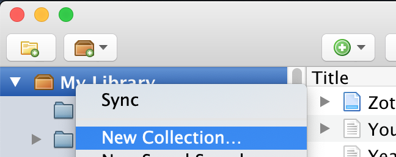
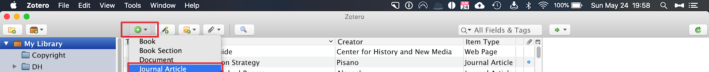
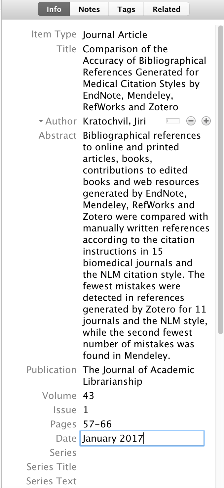
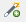
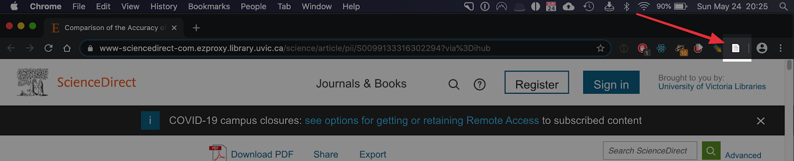
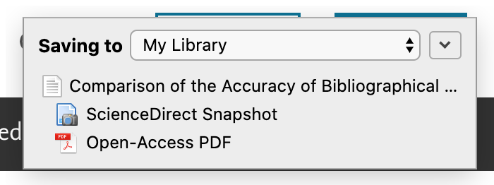
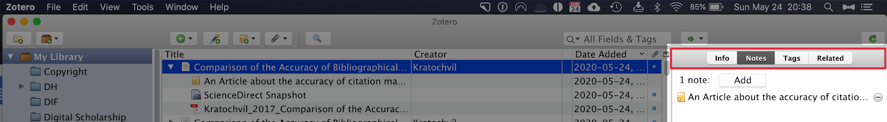

# Adding Your First Citations & Collections to Zotero

In this exercise, you will add your first citations to Zotero.  If you have any questions or get stuck as you work through this, please ask your instructor for assistance. Have fun!

1.  Make sure Zotero (the application you downloaded and installed) is open and running
2.  Before you make your first citation, let’s make sure that you’re prepared... **Begin with this in mind**:
    
    
    
    -   A citation is only as good as its initial input. Make sure to verify all the information when you import a citation from the web or by hand.
    -   You can import citations directly into “collections” (or folders) on the left-hand panel by highlighting that folder or collection before you import.
    
    

3.  **Create a Citation Manually**
    
    
    
    
    
    -   With Zotero open, click on the “**add citation**” button  and choose “**journal article**” as your document source.
    -   Once you choose the document source, a new “**info**” panel will open up on the right-hand side of your screen in which you can enter your source document information.
    -   Navigate to [this link](https://www-sciencedirect-com.ezproxy.library.uvic.ca/science/article/pii/S0099133316302294?via%3Dihub){:target="_blank"} (UVIC Students) or [this link](https://scholar.google.com/scholar?hl=en&as_sdt=0%2C5&q=Comparison+of+the+Accuracy+of+Bibliographical+References+Generated+for+Medical+Citation+Styles+by+EndNote%2C+Mendeley%2C+RefWorks+and+Zotero&btnG=){:target="_blank"} (non-UVic Students) to view an article on citation management. Copy and paste the relevant information from this article into the “**info**” pane in Zotero. If there is a DOI associated with an article, it is always a good idea to include it with your citation.
    -   Once you are finished you can click out of the info pane and the citation should now be in your library.

    

4.  **Create a Citation Using the “Add Item by Identifier” tool**
    -   Click on the “**add item by identifier**” icon 
    -   A new box will appear. Enter the DOI address from the citation we just made: https://doi.org/10.1016/j.acalib.2016.09.001
    -   After a few seconds, a new citation should appear in your Zotero citation list. Look at the “**info**” pane from this citation and compare it to the one you just entered by hand. Note the diacritical marks in the author’s first name between the two entries.

    

5.  **Create a Citation by Using the Browser Connector (from Activity 1)**
    -   Let’s go back to the libraries’ webpage for the [article on citation management software](https://www-sciencedirect-com.ezproxy.library.uvic.ca/science/article/pii/S0099133316302294?via%3Dihub){:target="_blank"} on Summon at UVIC Libraries  (non-UVic students, [click here](https://www.sciencedirect.com/science/article/abs/pii/S0099133316302294){:target="_blank"}).
    
    
    
    
    
    -   With Zotero open in the background and your browser as your main window, click on the **Zotero Browser Connector** icon in your browser.
    -   A new window will appear indicating that Zotero is importing the citation ***and*** PDF directly into your library.

    

6.  **Add “Notes” and “Tags” and “Related” to Your Citation**
    -   Tags are usually single words or compound words that describe the article in language understandable to you. For this article, I might use the following tags: “**accuracy**,” “**citation managers**,” and “**librarianship**.”
    -   Notes are descriptions of the article that you write **that can also be used when creating annotated bibliographies**.
    
    
    
    -   “**Related**” allows you to link an article with other articles in your collection. (I use this feature sparingly and tend to rely on tags to accomplish this function).

    

7.  **Attach a File to a Citation in Zotero.**
    -   When you see a little grey triangle next to the title of a citation, it means that there are other associated files with your citation. These can include PDF files, snapshots of a webpage, notes, or any other file you decide to “attach” to your citation.
    -   “Right click” on the main citation title to rev**e**al a submenu.
    
    
    
    -   Navigate to “**Add Attachment**” and then “**Attach Stored Copy of File**” (Note: if you attach a “stored copy” of a file in Zotero, it will be available to you offline).
    -   Choose a random document from your desktop to attach to the citation. Zotero will create a copy and store it in its database.
    
    <mark style="background-color:orange;"><b>Note:</b> This is the same procedure you will use to attach a PDF of an article if the automatic download function does not work.</mark>
    
    
    
    **Congratulations**, you now have your first citation (and PDF) in Zotero. We can now CITE something in our word processor program.

[NEXT STEP: Adding Citations & Creating Bibliographies in Word & Google Docs](act-3.html){: .btn .btn-blue }
