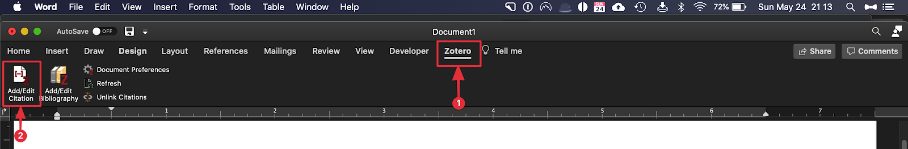
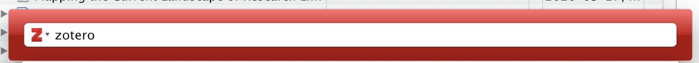
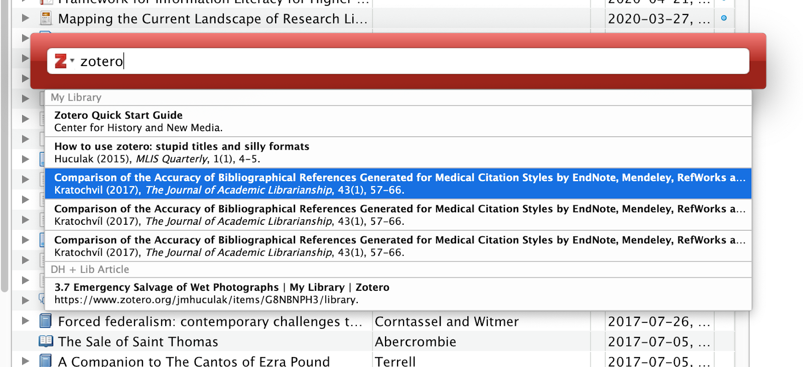
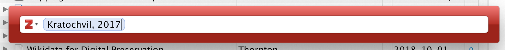
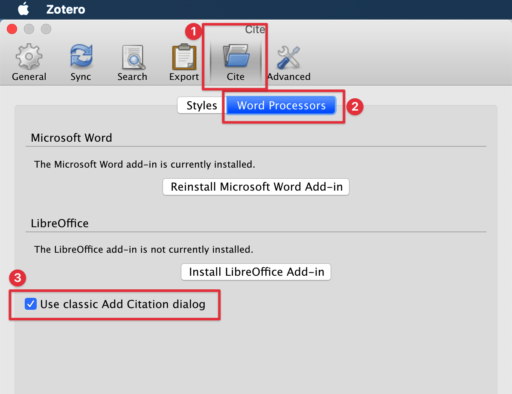
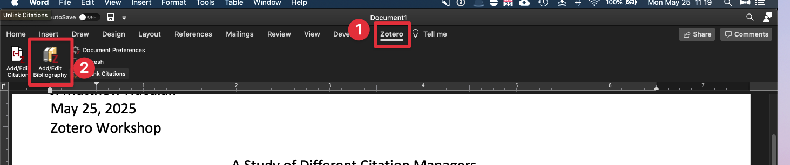
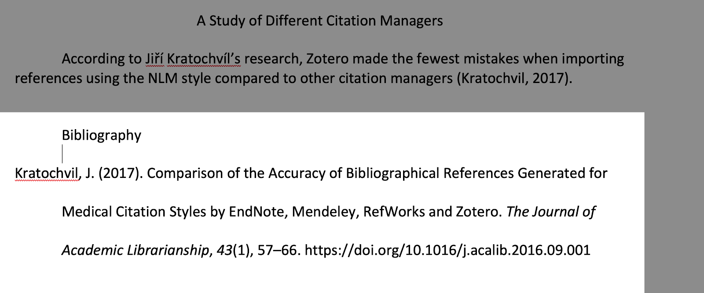
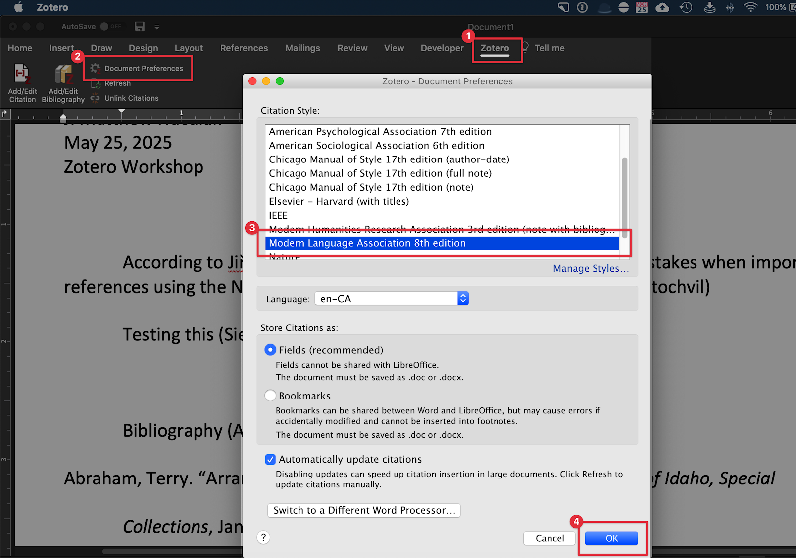

# Adding a Citation to Microsoft Word and Google Docs

The methods for adding citations in Microsoft Word and Google Docs are similar. For this exercise we will be using Microsoft Word for illustration, but you are able to use the same menus/instructions in Google Docs as well if you would prefer to follow along using Docs.

1.  **Adding Citations**
    -   Open Microsoft Word or Google Docs and Zotero
    -   Copy and paste the following sentence into a new Microsoft Word document (or Google Doc): “According to Jiří Kratochvíl’s research, Zotero made the fewest mistakes when importing references using the NLM style compared to other citation managers”
    -   To insert a citation to back up our claim, in Word, position your cursor before the period at the end of the sentence.
    -   Locate the “Zotero” menu tab, click it, and select “Add/Edit Citation” (if you do not see a Zotero tab, please close and restart Word. If you still can’t see it, please let your instructor know).
    
    
    
    -   Since this is the first time you’re using Zotero, a new window will appear asking you to choose a citation style. Choose the American Psychological Association 7th Edition style and click “OK.” A new Zotero window will appear in which you can start typing the author’s name or the title of the article.
    
    
    
    -   Type the word “zotero” into the window. This will bring up all the articles with Zotero as part of their metadata.
    
    
    
    -   In the dropdown menu the appears, select the article we downloaded by clicking the title.
    
    
    
    -   When you have selected the article, the Zotero window will look like this:

    

    -   Hit “Enter” (or return) on your keyboard to actually insert the citation into your Word document. Your Word document should now have a citation embedded in it that looks like this:
    
    
    
    -   I personally don’t like using this search box when using Zotero and find the “Classic” box to be more useful. To try out the classic viewer, follow the instructions above, but when you get to the Zotero search bar, click on the little grey arrow next to the Z and select “Classic View.”
    
    
    
    
    
    
    
    -   If you’d like to enable this permanently, you can do so in Zotero by going to “Preferences” -> Cite -> Word Processors -> check “Use classic Add Citation dialog”
    
    
    
    -   Congratulations! You have inserted your first citation. Now let’s create a Bibliography.

2.  **Creating a Bibliography using Zotero**
    -   In your Word document, navigate to the place you would like to insert your bibliography (or Works Cited, References, etc.). In Word, I usually go to “Insert → Page Break” in order to create a new section for my bibliography, but for this exercise, let’s simply hit return a couple of times after our final sentence from the previous example.
    -   To create a bibliography (or Works Cited, References, etc.) page, select the Zotero tab in your word processor and click “Add/Edit Bibliography.”
    
    
    
    -   After a few seconds (or sometimes more, depending on the size of your document), a bibliography will appear like this:
    
    
    
    
    
    -   Congratulations! You’ve created your first bibliography

    <mark style="background-color:coral;"><b>Pro-Tip:</b> You may also create a bibliography by "highlighting" sources in Zotero from which you would like to create a bibliography. "Right click" on those sources and then select "Create Bibliography from Items". You may paste this bibliography directly into Word or Google Docs, but be aware that this bibliography is not linked to the citations in the paper. Try it now!</mark>

    

3.  **Change the Citation Style of the Paper**
    If you need to submit your paper to different journals, you may need to change your citation style to the house style or other standard style. Don’t worry, Zotero has thousands of styles to choose from and install.
    -   To change the citation style* of your paper, go to Microsoft Word (or Google Docs) and select the Zotero tab.
    -   Select “Document Preferences”. A new window will appear in which you can select your new citation style. Once you select your new style, click “OK.”
    
        
    
    -   Verify that your document has changed styles.
    
        
    
    -   Congrats! You are now ready to save massive amounts of time!
    -   **NOTE:** Changing styles works seamlessly only if you are moving from one parenthetical style to another or one footnote style to another footnote style. If you need to switch from a parenthetical style to a footnote style, you will need to do some extra labour.

[NEXT STEP: Installing & Using Plugins in Zotero](act-4.html){: .btn .btn-blue }
