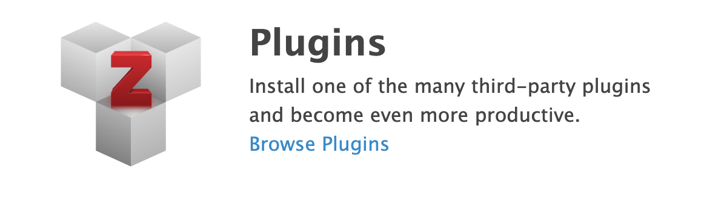
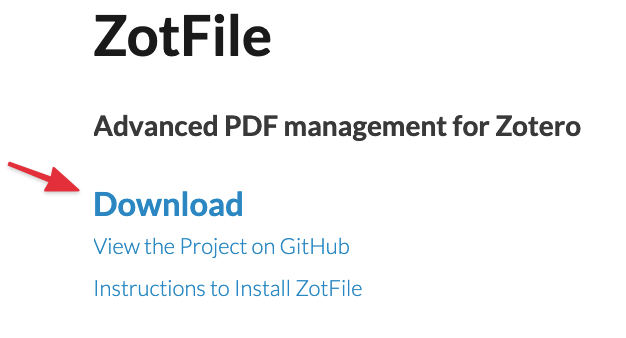
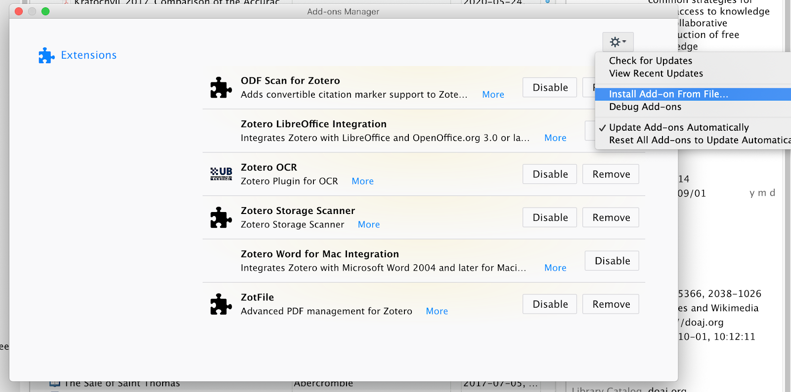
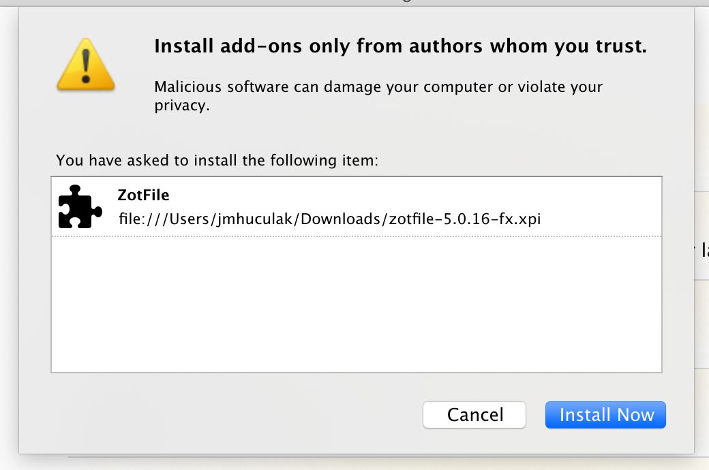
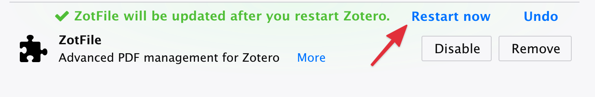
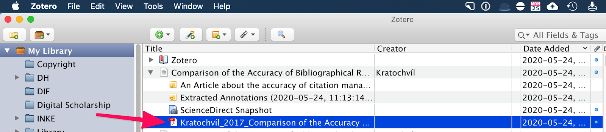
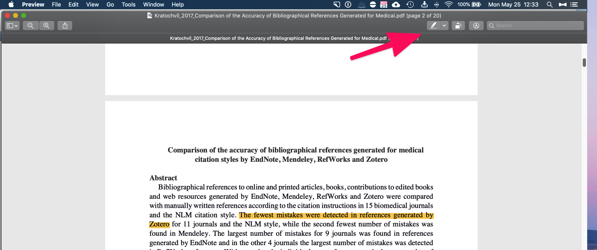
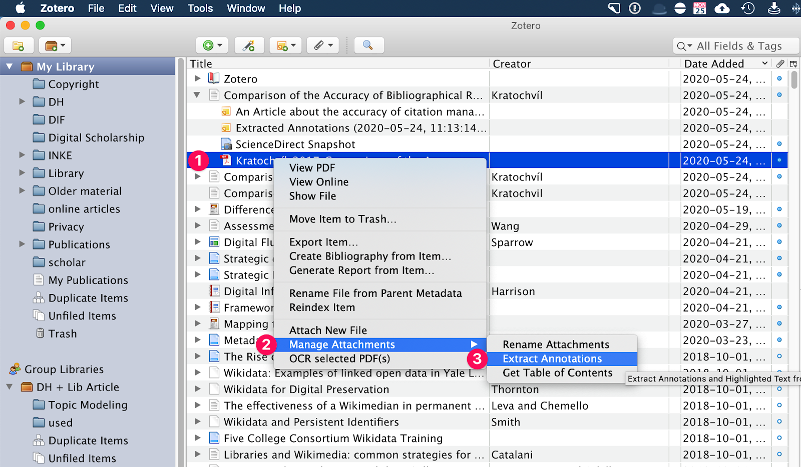
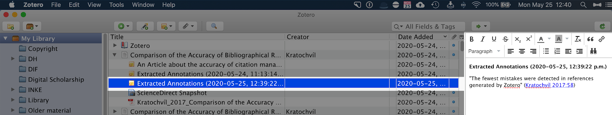

# Installing & Using Plugins in Zotero: Zotfile

In this exercise, you will add your first plugin to Zotero.  Zotfile is a powerful tool that renames PDFs in a human readable format and allows you to make and extract annotations from PDFs in your Zotero library.  If you have any questions or get stuck as you work through this, please ask your instructor for assistance. Have fun!

1.  Navigate to the [Zotero Downloads](https://www.zotero.org/download/){:target="_blank"} page and scroll down to the section called “Plugins.” Select “Browse Plugins.”
2.  Scroll down and click the “Zotfile” [link.](http://zotfile.com/){:target="_blank"}
3.  At the Zotfile page, click “Download,” which will download an .xpi file to your computer (if you’re using Firefox, please “right click” on “Download” and choose “save link as…” in order to save it to your computer).

    

4.  Open Zotero and go to Tools -> Add-Ons
5.  In the add-on’s pane, choose the “gear” icon on the right-hand side of the screen and choose “Install Add-on from File…”
6.  Navigate to the “zotfile-5.0.16-fx.xpi” file that we just downloaded to your computer and click “Install Now”

    
    
    

7.  Once the Plug-in is installed, you will need to click the “restart now” link in the Add-On menu:

    
    
    

8.  Congratulations, you’ve now installed Zotfile!

## What Does Zotfile Do?

<mark style="background-color:orange;"><b>Take home:</b> Zotfile renames your files into human-readable formats and allows you to extract and manage your annotations in PDFs. It also can organize your Zotero folder so your PDFs appear in human-readable folders on your computer.</mark>

A lot of what Zotfile does for your research happens behind the scenes. For example, when you import a new PDF, it will automatically rename the PDF according to the “title” metadata tag embedded in the document. This means that a PDF that was named “0023453232.pdf” in the library’s database will be renamed to “huculak_WhyZoteroIsAwesome.pdf,” which makes it easier to find your research in a human-readable way. 

Where Zotfile really excels, however, is in managing your Annotations. If your PDF has readable “text” that can be highlighted, Zotfile will extract all of your highlights in a PDF and make them into “notes” that you can copy and paste into your writing. I use these notes when I revisit a PDF so I can quickly scan through what I found was important in the article. This saves a lot of time for me.

## Creating and Extracting Annotations with Zotfile

Note: in order to use this functionality, you must have “attached” or “downloaded” a PDF when you imported or created a citation in Zotero. Also verify that you have a PDF viewer on your computer. If you’re on a Mac, you already have “Preview” installed. If you are on a PC, please download and install the free version of Adobe Reader.

1.  Find the citation we imported in Activity 1: “Comparison of the Accuracy of Bibliographical….
2.  Click the grey down arrow next to the left of the citation to review the child objects associated with the citation.
3.  Double click on the PDF file associated with the citation in order to open it.

    

4.  Let’s highlight a sentence in the PDF using the “highlighter” function in our PDF viewer. In Preview, it looks like this:

    
    
    

5.  Now “Save” your PDF by going to File -> Save
6.  Normally, your PDF should just save, but sometimes, when you’re on a PC, a Save Dialogue back comes up. Simply choose the exact same folder your file is in and hit save and “replace” should this dialogue box appear.
7.  Once the PDF is saved, let’s return to Zotero and the citation we just opened.
8.  Right click on the PDF icon in the citation and choose “Manage Attachments” and then “Extract Annotations”:

    

9.  If the PDF was saved properly, a new NOTE file will appear with the sentence you had highlighted along with the page number on which it appeared.

    
    
    

10.  Congratulations! You’ve extracted your first annotations! 

Note: When you “extract annotations”, it is a one-time crawl of your document that looks for annotation tags. If you make more annotations in the same document, you’ll want to extract annotations again in order to see those new highlights or comments. 

## Rename a PDF that You Previously Imported Using Zotfile

1.  Right click on the PDF in the citation and select Manage Attachments → “Rename Attachments.”

    

## Other Useful Plugins

Zotero has a slew of useful plugins for your use available [for download.](https://www.zotero.org/support/plugins){:target="_blank"} These include but are not limited to:

-   A barcode scanner for your iPhone to import books directly into your library
-   A DOI manager
-   A folder Import function if you are importing files from your computer
-   Zotero OCR: An OCR engine to create machine-readable PDFs. (we learn about this tool in the “Advanced” Zotero workshop).

[NEXT STEP: Earn a Workshop Badge](informal-credentials.html){: .btn .btn-blue }
